<!-- ========================================================= -->
<!--                    TOSHAN KANWAR                         -->
<!--               GITHUB PROFILE README                      -->
<!-- ========================================================= -->

 

  

  

---

# 👨‍💻 About Me

<table>
<tr>

<td width="58%" valign="top">

### Hey! I'm Toshan 👋

I'm a **Data Science & Artificial Intelligence graduate from IIIT Naya Raipur** who enjoys building real-world software products.

- 🌐 Full-Stack Web Development
- 🤖 Artificial Intelligence & Machine Learning
- 📊 Data Science & Visualization
- 📱 Cross-Platform Applications
- ☁️ Cloud, Deployment & DevOps
- 🔐 APIs, Authentication & Backend Systems

I enjoy taking an idea from:

**Concept → Development → Deployment → Improvement**

### 🚀 Currently Exploring

| Area | Focus |
|---|---|
| 🤖 AI / ML | Deep Learning & Modern AI |
| 🌐 Full Stack | Next.js, React & Node.js |
| ☁️ Cloud | Docker, Cloudflare & Deployment |
| 🏗️ Architecture | APIs, System Design & Scalable Apps |

</td>

<td width="42%" align="center">

  

</td>

</tr>
</table>

---

# 🧠 What I Build

<table>
<tr>
<th>🌐 Web</th>
<th>🤖 AI / ML</th>
<th>📊 Data</th>
<th>📱 Apps</th>
</tr>

<tr>
<td align="center">

Next.js 
React 
Node.js 
Express

</td>

<td align="center">

Python 
TensorFlow 
Scikit-Learn 
NLP

</td>

<td align="center">

Pandas 
NumPy 
Visualization 
Data Analysis

</td>

<td align="center">

Flutter 
Android 
Firebase 
REST APIs

</td>
</tr>
</table>

---

# 🛠️ Technology Stack

### 💻 Languages

### 🎨 Frontend

### ⚙️ Backend

### 🗄️ Database & Cloud

### 🤖 AI / Data Science

  

### 🔧 Tools & DevOps

---

# 🚀 Featured Projects

## 🧁 Toshan Bakery

  

A complete online bakery platform with product management,
shopping cart, checkout, order management and admin analytics.

**Next.js · Firebase · Node.js · Razorpay**

  

---

## ❤️ Heart Failure Prediction

  

Machine-learning powered application for predicting heart failure risk
through an interactive web interface.

**Python · Flask · React · Machine Learning**

  

---

## 📈 Indian Market Visualization

  

Interactive visualization platform for Indian stock-market data,
market activity and financial indicators.

**Next.js · APIs · MongoDB · Cloudflare Workers**

  

---

## 🧠 Automated Answer Assessment

AI-based answer evaluation system combining OCR,
semantic similarity and NLP techniques.

**Python · OCR · BERT · SBERT · NLP**

  

---

## ✍️ Poetry Platform

Modern poetry platform featuring dynamic content,
comments and administrative management.

**Next.js · Firebase · JavaScript**

  

---

## 🔗 Link-in-Bio Platform

A Linktree-style platform with dynamic profiles,
custom links and username-based routing.

**Next.js · Node.js · Database**

 

---

# 📊 GitHub Dashboard

 

---

# 📈 My GitHub Activity

---

# 🐍 Contribution Snake

<picture>

<source media="(prefers-color-scheme: dark)" srcset="https://raw.githubusercontent.com/toshankanwar/toshankanwar/output/github-contribution-grid-snake-dark.svg"/>

<source media="(prefers-color-scheme: light)" srcset="https://raw.githubusercontent.com/toshankanwar/toshankanwar/output/github-contribution-grid-snake.svg"/>

</picture>

---

# 🎯 2026 Goals

<table>
<tr>
<td align="center">🚀</td>
<td><b>Production Development</b> Build more real-world applications</td>
</tr>

<tr>
<td align="center">🤖</td>
<td><b>Artificial Intelligence</b> Explore modern AI & LLM technologies</td>
</tr>

<tr>
<td align="center">☁️</td>
<td><b>Cloud & DevOps</b> Improve deployment and infrastructure skills</td>
</tr>

<tr>
<td align="center">🌐</td>
<td><b>Open Source</b> Contribute to more open-source projects</td>
</tr>

<tr>
<td align="center">📚</td>
<td><b>Continuous Learning</b> Keep learning and building every day</td>
</tr>

</table>

---

# ⚡ Quick Facts

| Category | Details |
|---|---|
| 🎓 Education | B.Tech — Data Science & AI |
| 🏫 University | IIIT Naya Raipur |
| 💻 Primary Focus | Full-Stack Development |
| 🤖 AI Focus | Machine Learning / NLP |
| 🌐 Frontend | Next.js / React |
| ⚙️ Backend | Node.js / Flask |
| 🗄️ Database | Firebase / MongoDB |
| 📱 Mobile | Flutter / Android |
| ☁️ Deployment | Docker / Cloudflare / Vercel |
| 🧩 Approach | Build → Learn → Improve |

---

# 🌐 Connect With Me

---

# 💭 Developer Philosophy

### "Don't just learn technology. Build something with it."

 

**Idea → Code → Test → Deploy → Improve → Repeat 🔁**

---

### ⭐ If you find my projects useful, consider giving them a star!

 

  

 

<!-- ========================================================= -->
<!--                     END OF README                         -->
<!-- ========================================================= -->
